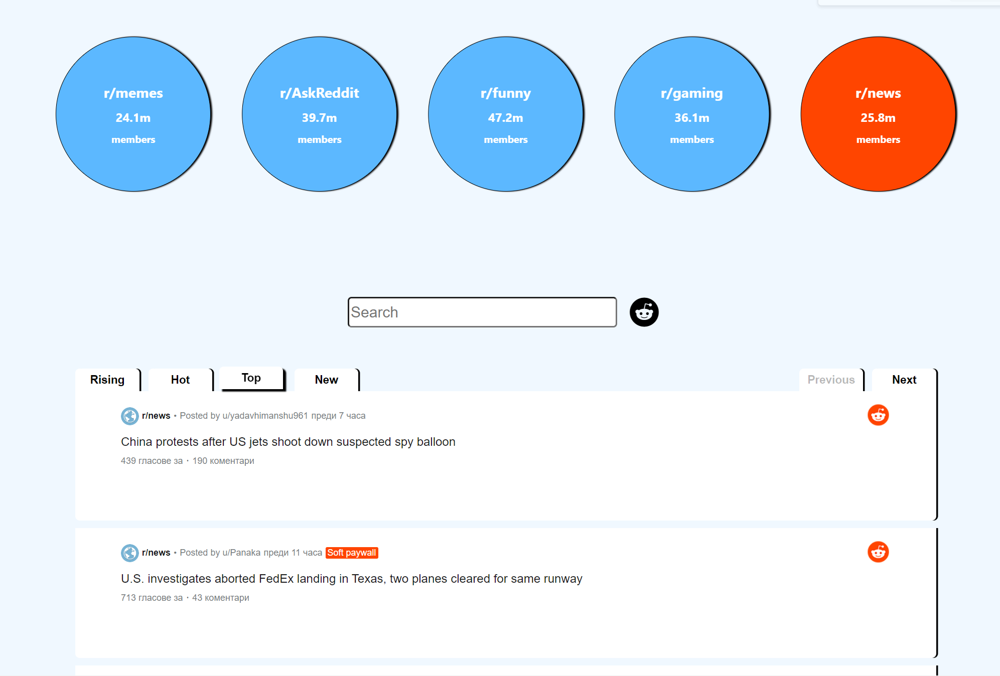

# [LilReddit](https://lil-reddit.herokuapp.com/)

The app is currently deployed on Heroku. To open it, please click the link in the heading or find it at the following URL:  
**https://lil-reddit.herokuapp.com/**

***

# Project Overview

This project was bootstrapped with [Create React App](https://github.com/facebook/create-react-app), using the [Redux](https://redux.js.org/) and [Redux Toolkit](https://redux-toolkit.js.org/) template.

It is a client-side only application that connects to the [Reddit API](https://www.reddit.com/dev/api/), retrieves and represents reddit posts.

The process is initialized in any of the following manners:
- A direct search using the provisioned search bar
- Selecting any of the five popular subreddits

The data retrieved is partitioned in 20 post per page, and the user has the ability to browse through pages using the **next** and **previous** and sort the results by the following criteria: **rising**, **hot**, **top**, or **new**. You can also view each post's comments and likes.

***

# In-app images

*** 

# Local Installation and Usage

**NPM is required to run this app locally**

1. Clone/Download this repository
2. Install dependencies with **npm install**
3. Run the app with **npm start**
4. Open [http://localhost:3000](http://localhost:3000) to view it in your browser.